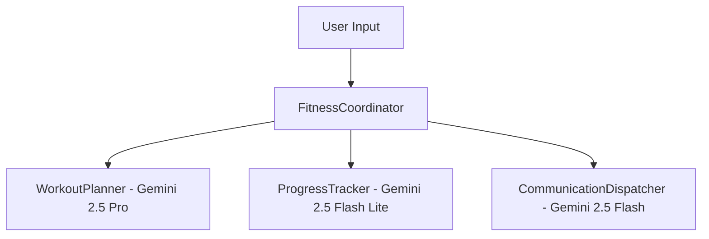

# Exercise Planner & Tracker Agent 🏋️‍♂️

A multi-agent AI system built with Google's **Agent Development Kit (ADK)** and **Gemini 2.5** to design personalized workout routines, track exercise logs, and dispatch weekly email digests.

## 🏗️ Multi-Agent Architecture



## 🚀 Quick Start

### 1. Installation
```bash
git clone https://github.com/your-username/exercise-planner-agent.git
cd exercise-planner-agent
pip install -r requirements.txt
```

### 2. Set Up Environment Variables
```bash
export GOOGLE_GENAI_USE_VERTEXAI=1
export GOOGLE_CLOUD_PROJECT="your-gcp-project-id"
export GOOGLE_APPLICATION_CREDENTIALS="/path/to/credentials.json"
```

### 3. Run Interactive CLI Chat
```bash
python3 interactive_chat.py
```

### 4. Run Unit & Benchmark Evaluation Tests
```bash
pytest tests/
python3 run_eval.py
```

## ☁️ Deployment

### Deploy to Vertex AI Agent Engine
```bash
python3 deploy_vertex.py \
  --project_id="your-gcp-project-id" \
  --location="us-central1" \
  --staging_bucket="gs://your-gcs-staging-bucket"
```

### Deploy to Cloud Run via Terraform
```bash
terraform init
terraform apply -var="project_id=your-gcp-project-id"
```
